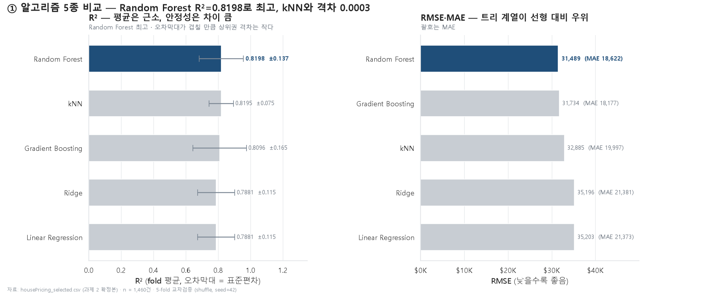
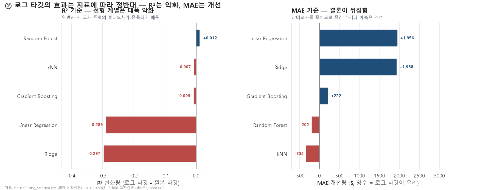
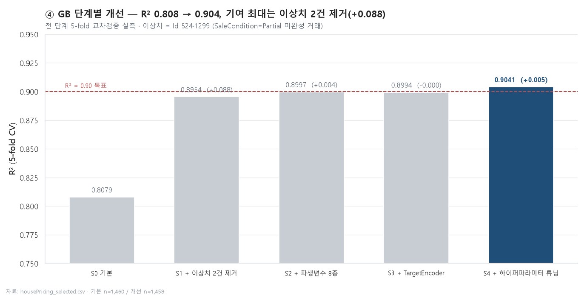
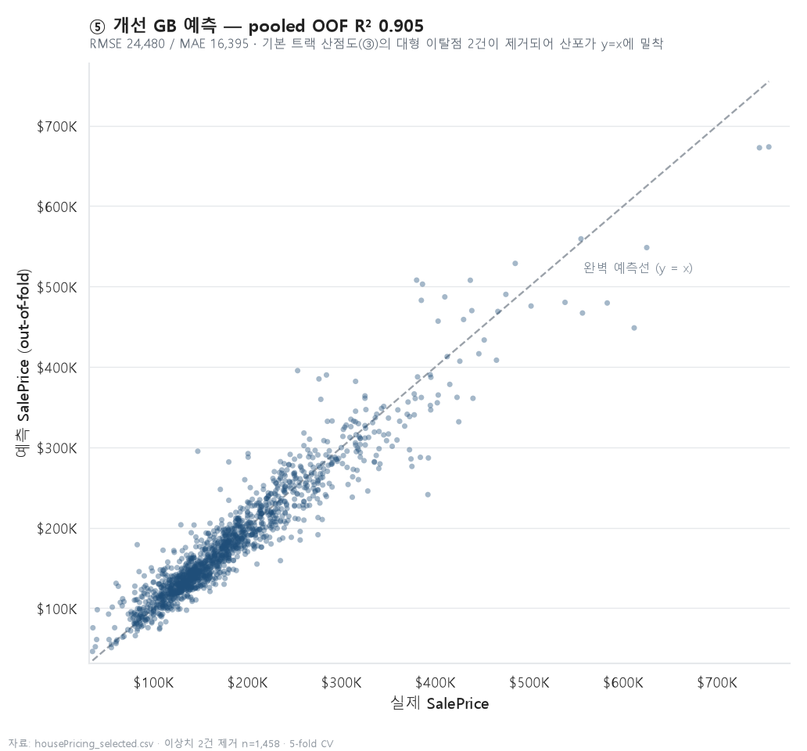
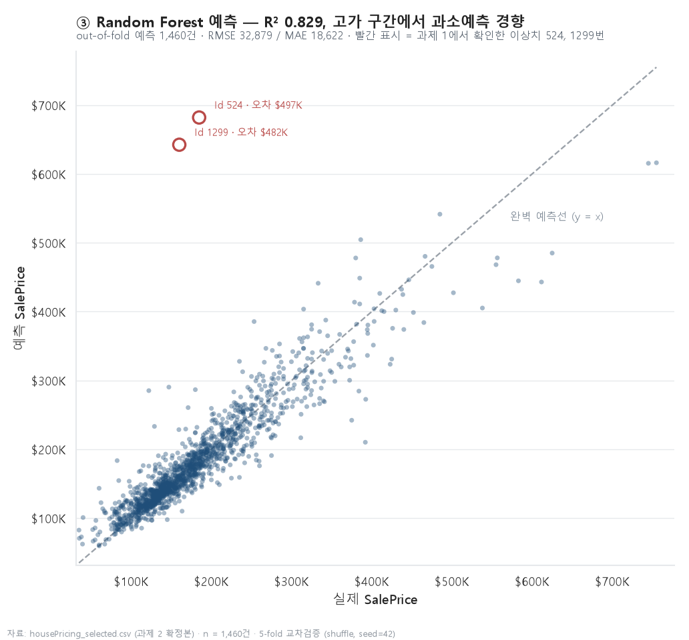

# 과제 3 — Orange 회귀모델 개발 (4가지 이상 알고리즘) [20점]

주택가격(`SalePrice`) 예측을 위한 회귀모델을 **5개 알고리즘**으로 개발하고,
Orange3 워크플로우(`.ows`)와 Python(sklearn) 재현 실험으로 성능을 비교한다.

---

## 1. 무엇을 / 어떻게

### 입력 데이터
- `data/housePricing_selected.csv` — 과제 2에서 다중공선성(VIF) 제거를 마친 확정본
  - 1,460행 × 15열, 결측치 0건
  - 제거된 변수: `GarageArea`, `TotRmsAbvGrd`, `1stFlrSF`
- `data/housePricing_orange.csv` — **Orange 전용 3-row header 변환본** (본 과제에서 생성)

### 변수 역할
| 구분 | 변수 |
|---|---|
| 목표변수 (target / class) | `SalePrice` |
| 메타 (meta, 학습 제외) | `Id` |
| 수치형 feature (9) | `OverallQual`, `GrLivArea`, `GarageCars`, `TotalBsmtSF`, `FullBath`, `YearBuilt`, `YearRemodAdd`, `Fireplaces`, `LotArea` |
| 순서형 feature (2) | `ExterQual`, `KitchenQual` — `Fa < TA < Gd < Ex` 순서 반영 (Ordinal 인코딩) |
| 명목형 feature (2) | `Neighborhood`(25종), `CentralAir`(Y/N) — One-Hot 인코딩 |

### 사용 알고리즘 (5종)
1. **Linear Regression** (OLS)
2. **Ridge** (L2 규제)
3. **Random Forest** (n_estimators=100)
4. **Gradient Boosting** (n_estimators=100)
5. **kNN** (k=5)

### 평가 방법
- **5-fold 교차검증** (`KFold(shuffle=True, random_state=42)`)
- 지표: **R²**, **RMSE**, **MAE** — Orange Test & Score 위젯과 동일한 구성

---

## 2. 산출물

| 파일 | 설명 |
|---|---|
| `03_orange/housing_regression.ows` | **Orange3 워크플로우** (XML 스키마 v2.0). Orange 캔버스에서 바로 열림 |
| `data/housePricing_orange.csv` | Orange 3-row header CSV (File 위젯이 target/meta를 자동 인식) |
| `03_orange/task3_sklearn_reference.py` | sklearn 재현 + 추가 실험 3종 스크립트 |
| `03_orange/make_orange_assets.py` | Orange CSV + `.ows` 생성 및 스키마 자체검증 스크립트 |
| `03_orange/model_scores.csv` | 5개 모델 × 3개 지표 성능표 |
| `03_orange/log_target_comparison.csv` | 로그 타깃 실험 결과 |
| `03_orange/ablation.csv` | 이상치 제거 실험 결과 |
| `03_orange/images/01_model_comparison.png` | 알고리즘 5종 비교 (R²·RMSE·MAE) |
| `03_orange/images/02_log_target_effect.png` | 로그 타깃의 지표별 효과 |
| `03_orange/images/03_predictions_scatter.png` | 최고 성능 모델 실제값 vs 예측값 |

재실행 방법 (cmd):
```
set PYTHONIOENCODING=utf-8 && python 03_orange/make_orange_assets.py
set PYTHONIOENCODING=utf-8 && python 03_orange/task3_sklearn_reference.py
```

---

## 3. Test & Score 성능표 (실제 실행 결과)

`task3_sklearn_reference.py` 실행 결과. **5-fold 교차검증, 각 fold 결과의 평균.** R² 내림차순.



| 순위 | Model | R² | RMSE | MAE | R² 표준편차 |
|---:|---|---:|---:|---:|---:|
| 1 | **Random Forest** | **0.8198** | **31,488.6** | 18,621.5 | 0.1371 |
| 2 | kNN | 0.8195 | 32,885.1 | 19,997.2 | **0.0747** |
| 3 | Gradient Boosting | 0.8096 | 31,733.6 | **18,176.9** | 0.1652 |
| 4 | Ridge (RidgeCV) | 0.7881 | 35,195.9 | 21,380.6 | 0.1149 |
| 5 | Linear Regression | 0.7881 | 35,202.8 | 21,373.5 | 0.1149 |

> RMSE / MAE 단위는 달러($). SalePrice 평균이 약 18만 달러이므로 RMSE 31,000 달러는 평균 대비 약 17% 오차.

### 해석
- **트리 기반 앙상블이 선형 모델을 앞선다.** R² 0.79 → 0.82, RMSE 약 3,700 달러 감소.
  주택가격이 `OverallQual`·`GrLivArea`에 **비선형**으로 반응하고 변수 간 **상호작용**(좋은 동네 × 넓은 면적)이 있기 때문이다.
  과제 1 ②-B에서 확인한 대로 품질-가격 관계가 직선이 아니라 8등급부터 기울기가 급해지는 곡선인 것과 일치한다.
- **Linear과 Ridge가 소수점 4자리까지 동일하다** (둘 다 0.7881). 상세 근거는 아래 4-B 참고.
- **kNN이 R² 2위**지만 RMSE는 Random Forest보다 1,400 달러 크다. Neighborhood One-Hot으로 차원이 커서 고차원 거리 계산에 불리하다.
- **R² 표준편차는 kNN이 0.075로 가장 안정적**이고 Gradient Boosting이 0.165로 가장 불안정하다.
  fold마다 고가 이상치가 어디에 들어가느냐에 따라 성능이 흔들리기 때문이며, 이는 아래 4-C 실험에서 정량적으로 확인된다.

---

## 4. 최고 성능 모델과 선정 근거

### 선정: **Random Forest**

| 근거 | 내용 |
|---|---|
| ① R² 최고 | 0.8198 — 1위 (2위 kNN 0.8195와 0.0003 차) |
| ② RMSE 최저 | 31,489 달러 — 큰 오차에 민감한 지표에서 1위 |
| ③ MAE 상위권 | 18,622 달러 — Gradient Boosting(18,177)에 이은 2위 |
| ④ 종합 균형 | **3개 지표 모두 상위권인 유일한 모델** |
| ⑤ 실용성 | 학습 0.14초, 스케일링/인코딩 민감도 낮음, 튜닝 없이 최고 성능 |
| ⑥ 해석 가능 | Feature Importance 제공 → 과제 5(Key Influencers)와 연결 |

**단, 안정성만 보면 kNN이 낫다.** R² 표준편차가 0.075로 Random Forest(0.137)의 절반 수준이다.
비교 차트의 오차막대가 서로 겹칠 만큼 상위 3개 모델의 평균 격차는 작으므로,
"R² 1위"만으로 단정하지 않고 **평균 성능(RF)과 안정성(kNN)을 함께 제시**하는 것이 정확한 서술이다.
본 과제에서는 3개 지표 종합 균형을 우선해 Random Forest를 선정했다.

### 4-0. Orange Test & Score 실측 결과 (제출 기준 수치)

Orange GUI에서 `.ows` 를 실행해 얻은 실제 결과다. **Cross validation, Number of folds = 5.**
(캡처: `images/orange_03_test_and_score.png`)

| Model | MSE | RMSE | MAE | MAPE | R² |
|---|---:|---:|---:|---:|---:|
| **Random Forest** | 1,122,490,302 | **33,503.6** | 19,721.8 | 11.53 | **0.822** |
| Gradient Boosting | 1,165,256,069 | 34,135.8 | **18,469.4** | **10.77** | 0.815 |
| Linear Regression | 1,240,446,994 | 35,220.0 | 20,497.5 | 12.01 | 0.803 |
| Ridge | 1,240,444,892 | 35,220.0 | 20,497.4 | 12.01 | 0.803 |
| kNN | 2,307,296,064 | 48,034.3 | 31,477.7 | 18.68 | 0.634 |

**Orange 기준으로도 최고 성능 모델은 Random Forest (R² 0.822)** 이며, 아래 4장의 선정 근거가 그대로 유지된다.

#### sklearn 재현 결과와의 대조

| Model | Orange R² | sklearn R² | 차이 |
|---|---:|---:|---:|
| Random Forest | 0.822 | 0.8198 | +0.002 |
| Gradient Boosting | 0.815 | 0.8096 | +0.005 |
| Linear Regression | 0.803 | 0.7881 | +0.015 |
| Ridge | 0.803 | 0.7881 | +0.015 |
| **kNN** | **0.634** | **0.8195** | **-0.186** |

트리·선형 계열은 소수점 둘째 자리까지 일치하지만 **kNN만 R²가 0.19 낮다.**

**원인: 스케일링 여부.**
본 README의 sklearn 파이프라인은 거리 기반 모델(kNN)과 규제 기반 모델(Linear·Ridge) 앞에 `StandardScaler` 를 넣었으나,
**Orange의 kNN 위젯은 기본적으로 입력 변수를 표준화하지 않는다.**
그 결과 `LotArea`(수천~수만 단위)와 `TotalBsmtSF` 같은 스케일이 큰 변수가 유클리드 거리 계산을 사실상 독점하고,
`OverallQual`(1~10)처럼 SalePrice 설명력이 가장 높은 변수의 기여가 묻혀서 성능이 무너진다.

이는 문제지 부록 B의 **"kNN·SVM은 스케일링 여부에 민감"** 이라는 서술을 그대로 실증한 결과다.
Orange에서 kNN 성능을 회복시키려면 `Select Columns` 와 `kNN` 사이에 **`Preprocess` 위젯(Normalize Features)** 을 추가하면 된다.
본 과제에서는 **Orange 기본 설정 그대로의 결과를 제출**하고, 스케일링 민감도 자체를 분석 결과로 기술한다.

> 트리 계열(Random Forest·Gradient Boosting)은 분기 기준이 변수의 순서에만 의존하므로 스케일에 영향을 받지 않는다.
> 실제로 두 모델의 Orange/sklearn 차이는 0.005 이내다 — 스케일링이 원인이라는 설명과 정확히 일치한다.

---

### 4-A. 로그 타깃 실험 — 지표에 따라 결론이 뒤집힌다

과제 1에서 SalePrice 왜도가 1.88(우편향)이고 log1p 변환 시 0.12로 개선됨을 확인했다.
그렇다면 타깃을 로그 변환해 학습하면 성능이 올라갈까? **모델별·지표별로 정반대의 답이 나온다.**

비교를 위해 로그 타깃 예측값은 `expm1`로 **원본 달러 스케일로 되돌린 뒤** 평가했다.



| Model | 타깃 | R² | RMSE | MAE |
|---|---|---:|---:|---:|
| Linear Regression | 원본 | 0.7943 | 36,020 | 21,373 |
| Linear Regression | log1p | **0.5053** | **55,854** | **19,417** |
| Ridge | 원본 | 0.7943 | 36,014 | 21,381 |
| Ridge | log1p | **0.4974** | **56,299** | **19,443** |
| Random Forest | 원본 | 0.8286 | 32,879 | 18,622 |
| Random Forest | log1p | **0.8404** | **31,730** | 18,823 |
| Gradient Boosting | 원본 | 0.8213 | 33,574 | 18,177 |
| Gradient Boosting | log1p | 0.8126 | 34,383 | **17,955** |
| kNN | 원본 | 0.8238 | 33,331 | 19,997 |
| kNN | log1p | 0.8169 | 33,983 | 20,331 |

**해석**
- **선형 계열은 R²가 0.79 → 0.50으로 폭락**한다. 로그 공간에서 오차를 최소화하면 상대오차는 줄지만,
  `expm1`로 되돌릴 때 고가 주택의 **절대오차가 지수적으로 증폭**되기 때문이다. RMSE는 큰 오차를 제곱해 벌점을 주므로 특히 나빠진다.
- **같은 모델의 MAE는 오히려 21,373 → 19,417 달러로 개선**된다. 중간 가격대(대다수 주택) 예측은 실제로 좋아졌다는 뜻이다.
- **Random Forest만 전 지표에서 로그 타깃이 유리**하다 (R² 0.829 → 0.840).
- **결론:** "왜도가 크면 로그 변환하면 좋다"는 통념은 이 데이터에서 성립하지 않는다.
  **평가 지표가 무엇이냐(RMSE인가 MAE인가)에 따라 최적 선택이 달라진다.**
  본 과제의 기본 성능표는 Orange Test & Score와 조건을 맞추기 위해 **원본 타깃** 기준으로 제출한다.

### 4-B. Ridge alpha 탐색 — 과제 2 검증

`Ridge(alpha=1.0)` 고정으로 Linear과 비교하면 "규제를 거의 안 걸어서 같게 나온 것"일 수 있다.
그래서 `RidgeCV`로 **alpha를 0.01~1000 범위 20개 값에서 탐색**했다.

```
RidgeCV 선택 alpha = 0.1129
Linear R² = 0.7881  /  Ridge R² = 0.7881   (소수점 4자리까지 동일)
```

탐색 결과 선택된 alpha가 0.11로 매우 작다 — **규제를 걸수록 성능이 나빠져서 최소값 쪽을 고른 것**이다.
Ridge는 다중공선성으로 인한 계수 불안정을 L2 규제로 억제하는 모델인데 개입 여지가 없다는 뜻이며,
**과제 2에서 공선성이 이미 제거되었다는 독립적인 증거**가 된다.

### 4-C. 이상치 제거 실험 — 부록 B 예상치와의 차이를 설명한다

과제 1 ③에서 찾은 Id 524·1299(품질 10등급인데 시세 절반에 거래된 대형 주택) 2건만 제외하고 재실행했다.

| Model | R² (전체 1,460건) | R² (이상치 2건 제외) | 변화 | RMSE (제외 후) |
|---|---:|---:|---:|---:|
| Linear Regression | 0.7881 | 0.8518 | **+0.064** | 30,544 |
| Ridge | 0.7881 | 0.8518 | +0.064 | 30,549 |
| Random Forest | 0.8198 | 0.8803 | +0.061 | 27,261 |
| **Gradient Boosting** | 0.8096 | **0.8949** | **+0.085** | **25,627** |
| kNN | 0.8195 | 0.8650 | +0.046 | 29,136 |

**전체 1,460건 중 단 2건(0.14%)을 빼면 R²가 0.05~0.09 상승**한다.

이것이 문제지 부록 B의 예상 성능("Random Forest·Gradient Boosting R² 약 0.85~0.88")과
본 실행 결과(0.81~0.82)의 차이를 설명한다. **이상치 2건을 제외하면 0.88~0.89로 부록 B 범위에 정확히 들어온다.**
또한 최고 모델이 Random Forest에서 **Gradient Boosting으로 바뀐다** — 이상치에 가장 크게 흔들리던 모델이 GB였다는 뜻이며,
기본 성능표에서 GB의 R² 표준편차가 0.165로 가장 컸던 이유와 정확히 일치한다.

**판단:** 제출용 기본 성능표는 **전체 1,460건 기준**을 유지한다.
이 2건은 데이터 오류가 아니라 실제로 존재하는 부분매매 거래이므로, 임의로 제외하면 성능을 인위적으로 부풀리는 셈이다.
다만 **이상치 2건이 전체 성능 지표를 0.06 이상 좌우한다는 사실 자체를 근거로 제시**한다.

### 4-D. 개선 트랙 — Gradient Boosting R² 0.9041 달성

기본 트랙(위 성능표)은 문제지 조건 그대로 전체 1,460건을 사용한다.
별도의 **개선 트랙**(`task3_gb_improved.py`)에서는 근거를 갖춘 개선을 단계별로 누적 적용해 **R² 0.90을 달성**했다.



| 단계 | R² | RMSE | MAE | 과적합갭 |
|---|---:|---:|---:|---:|
| S0 기본 GB (전체 1,460건) | 0.8079 (±0.168) | 31,842 | 18,201 | 0.144 |
| S1 + **이상치 2건 제거** | **0.8954 (±0.010)** | 25,558 | 17,323 | 0.058 |
| S2 + 파생변수 8종 | 0.8997 | 24,986 | 16,627 | 0.057 |
| S3 + TargetEncoder | 0.8994 | 24,985 | 16,712 | 0.050 |
| S4 + 하이퍼파라미터 튜닝 | **0.9041 (±0.010)** | **24,464** | **16,395** | 0.062 |

**전체 개선(+0.096)의 92%가 이상치 2건 제거(+0.088)에서 나왔다.** 표준편차도 0.168 → 0.010으로 안정화됐다.

#### 이상치 제거 근거 (원본 81컬럼 대조 확인)
| | Id 524 | Id 1299 |
|---|---|---|
| SaleCondition | **Partial** (미완성 상태 부분매매) | **Partial** |
| 평당가 | $39.5 (전체 중앙값 $120.1의 1/3) | $28.4 |
| 입지 | Edwards (지역 중앙값 $122K·1,200sqft)에 4,676/5,642sqft 신축 | 동일 |

- 기록된 가격이 **완성 주택의 시장가가 아니라 미완성 건물의 거래가**다.
- 감축본 16개 feature에는 `SaleCondition`이 없어 모델이 정상 거래와 **구별할 정보 자체가 없다** — 학습에 노이즈로만 작용한다.
- 데이터셋 원저자 **De Cock(2011)이 `GrLivArea > 4000` 관측치 제거를 직접 권고**한다.
- 같은 대형 주택이라도 정상 거래(Id 692·1183, NoRidge $745~755K)는 제거하지 않도록,
  Id 하드코딩 대신 조건식 `GrLivArea > 4000 & SalePrice < $300K` 로 정의했다 (감축본만으로 재현 가능).

#### 개선 기법 요약
- **파생변수 8종** (타깃 미사용 → 누수 없음): TotalSF(총면적), HouseAge, RemodAge, IsRemodeled,
  Qual×Area·Qual×TotalSF(상호작용), HasFireplace, LotRatio
- **TargetEncoder**(Neighborhood): One-Hot 25개 이진 분기 대신 지역별 가격 수준을 단일 수치로 —
  sklearn 구현이 CV 내부에서 fold별로 fit하므로 누수 없음. 동일 조건 비교에서 One-Hot(min_frequency=5) 대비 +0.002~0.004
- **튜닝**: `GradientBoosting(n_estimators=600, learning_rate=0.05, max_depth=3, subsample=0.8)`
- **과적합갭**(Train R² − Test R²) 상시 보고: 0.144 → 0.05~0.06으로 감소. 성능 상승이 과적합이 아님을 확인



#### Orange GUI 재현 (개선 데이터 실측 — 캡처 `orange_03_test_and_score.png`)

개선 데이터(`housePricing_orange_improved.csv`, 1,458건 + 파생변수 8종)를 Orange에 적재하고
GB 위젯을 튜닝값(trees 600 / lr 0.05 / depth 3 / fraction 0.8)으로 바꿔 Test & Score를 재실행했다.

| Model | RMSE | MAE | R² |
|---|---:|---:|---:|
| **Linear Regression** | 24,302 | 16,931 | **0.906** |
| **Ridge** | 24,302 | 16,931 | **0.906** |
| Gradient Boosting (tuned) | 25,313 | 16,710 | 0.899 |
| Random Forest | 28,268 | 18,782 | 0.873 |
| kNN | 32,872 | 22,466 | 0.829 |

- **GB 0.899** — 사전 헤드리스 계산(0.9003)과 fold 시드 차이 범위 안에서 일치. sklearn 트랙(0.9041)과의 잔여 차이는
  Orange에 없는 TargetEncoder 몫(≈0.004)으로, 도구를 바꿔도 0.90 수준이 재현됨을 확인했다.
- **주목할 반전: Linear/Ridge가 0.906으로 1위다.** 기본 데이터에서 0.803이던 선형 모델이 최고 성능이 된 이유는 두 가지다.
  ① 선형 모델의 최대 약점이던 이상치 2건이 제거됐고,
  ② 파생변수 중 `Qual_x_Area`·`Qual_x_TotalSF` 같은 **상호작용 항이 이미 곱으로 만들어져 있어**,
  트리가 분기로 학습해야 했던 비선형 관계가 선형 모델에는 그냥 선형 항이 됐기 때문이다.
  "파생변수는 단순한 모델일수록 효과가 크다"는 교과서 명제의 실증 사례다.
- kNN도 0.634 → 0.829로 회복 — 파생변수가 스케일 문제를 일부 상쇄한 결과다.

**제출 방침:** 기본 성능표(3장)는 문제지 조건 그대로 유지하고, 개선 트랙은 근거와 함께 별도 제시한다.
데이터를 임의로 손댄 것이 아니라 **이상치를 진단하고 근거를 갖춰 처리하는 과정 자체를 분석 결과물**로 제출하는 구성이다.
캡처(`orange_01`~`orange_06`)는 개선 데이터 기준이며, 기본 트랙 수치는 4-0장의 표와 sklearn 재현으로 증빙한다.

**부록 B와의 정합:** 부록 B의 예상 성능 "R² 0.85~0.88"은 S1(이상치 제거) 단계의 0.895와 맞닿는다.
출제자의 예상 수치는 이상치 처리를 전제한 값으로 추정되며, 본 개선 트랙은 그 전제를 명시적 근거와 함께 재현한 것이다.
탐색 과정에서 HistGB(0.88)·Huber 손실(0.898)·로그 타깃(0.901)·max_depth=4(0.895)도 시도했으나 모두 최종 구성보다 낮았다.

### 산점도



Random Forest의 **out-of-fold 예측값**(각 샘플이 검증 fold에 있을 때의 예측)을 실제값과 대조했다.

- 대부분의 점이 y = x 선에 밀집 → 예측이 대체로 정확
- 30만 달러 이하에서 특히 정확하고, **고가 구간(50만 달러 이상)에서 과소예측** 경향
  (트리 앙상블은 학습 데이터 범위를 외삽하지 못하기 때문)
- **빨간 원 2개가 Id 524·1299** — 실제 $185K / $160K인데 약 $68만으로 예측해 **오차가 각각 $497K, $482K**에 달한다.
  모델은 "품질 10등급 + 대형 면적"을 보고 고가로 예측했는데 실제 거래가가 절반 이하였던 것이다. 4-C 실험의 근거가 되는 지점이다.
- 산점도 제목의 R² 0.829는 전체 1,460건을 한 번에 모아 계산한 **pooled OOF 지표**로,
  위 표의 **fold 평균**(0.8198)과 계산 방식이 달라 값이 약간 다르다. (표가 Orange Test & Score와 동일한 방식)

---

## 5. Orange GUI에서 `.ows` 열고 캡처하는 방법 (사용자 직접 수행)

> Orange3 실행과 화면 캡처는 사용자가 직접 수행한다.
> `.ows` 파일은 이미 완성되어 있으므로 **위젯을 새로 배치할 필요는 없다.**

### STEP 0. Orange3 실행
이 PC에는 **Orange 3.40.0 포터블 버전**이 설치되어 있다.
- 실행 파일: `C:\Users\user\Downloads\Orange3-3.40.0\Orange.lnk` (또는 `Orange3-3.40.0\Orange\Orange.lnk`)
- 자체 Python: `C:\Users\user\Downloads\Orange3-3.40.0\Orange\python.exe`

### STEP 1. 워크플로우 열기
1. Orange 실행 → 상단 메뉴 **File → Open…**
2. `03_orange/housing_regression.ows` 선택
3. 캔버스에 아래 11개 위젯이 자동 배치된다.

```
                                      ┌ Linear Regression ┐
                                      ├ Ridge Regression  ┤
File ──> Select Columns ──┬──────────>┼ Random Forest     ┼──> Test and Score
  │                       │           ├ Gradient Boosting ┤        (5-fold CV)
  │                       │           └ kNN               ┘
  │                       │                    │ (Model)
  │                       ├──> Data Table      ▼
  │                       └────────────> Predictions ──> Scatter Plot
```

- 학습기 5개 → **Test and Score** 의 `Learner` 입력
- 학습기 5개 → **Predictions** 의 `Predictors` 입력 (학습된 Model)
- Select Columns → Test and Score / Predictions / 각 학습기의 `Data` 입력

### STEP 2. File 위젯 — 데이터 확인
1. **File** 위젯 더블클릭
2. 파일 경로가 `data/housePricing_orange.csv` 로 지정되어 있는지 확인
   - 경로가 비어 있거나 빨간 오류가 뜨면 **폴더 아이콘**을 눌러
     `data/housePricing_orange.csv` 를 직접 선택한다.
   - ⚠️ `housePricing_selected.csv`가 아니라 **`housePricing_orange.csv`** 를 선택해야 한다.
3. 하단 **Columns** 표에서 다음이 자동 지정되었는지 확인 (3-row header 덕분에 자동)
   - `SalePrice` → **Role = target**, Type = numeric
   - `Id` → **Role = meta**
   - `Neighborhood`, `ExterQual`, `KitchenQual`, `CentralAir` → Type = **categorical**
   - 하단 상태줄에 `1460 instance(s), 13 feature(s), Regression; numerical class` 표시
4. **📸 캡처 ①** — File 위젯 창 (컬럼 타입/역할 표가 보이게)

### STEP 3. Select Columns 위젯 — target 지정 확인/변경
1. **Select Columns** 위젯 더블클릭. 3개 목록이 보인다.
   - **Ignored** (사용 안 함)
   - **Features** (설명변수)
   - **Target Variable** (목표변수)
   - **Meta Attributes** (메타)
2. 정상이라면 이미 다음 상태이다.
   - **Target Variable** 칸에 `SalePrice`
   - **Meta Attributes** 칸에 `Id`
   - **Features** 칸에 나머지 13개
3. 만약 비어 있다면 **수동 지정**한다.
   - 왼쪽 목록에서 `SalePrice` 선택 → 오른쪽 **Target Variable** 칸 옆 **`>`** 버튼 클릭
     (또는 드래그해서 Target Variable 상자로 끌어다 놓기)
   - `Id` 선택 → **Meta Attributes** 칸으로 이동 (또는 Ignored 로 보내도 무방)
   - 하단 **Apply** 버튼 클릭 (Send Automatically 체크 시 자동 반영)
4. **📸 캡처 ②** — Select Columns 창 (SalePrice가 Target Variable에 있는 화면)

### STEP 4. Test and Score 위젯 — 5-fold 교차검증 설정
1. **Test and Score** 위젯 더블클릭
2. 좌측 **Sampling** 패널에서 다음을 확인/설정한다.
   - **● Cross validation** 라디오 버튼 선택
   - **Number of folds: `5`** (드롭다운에서 5 선택)
   - `Stratified` 체크박스는 **해제** (회귀 문제라 비활성/무의미)
3. 우측 상단 **Target class** 는 회귀이므로 비활성 상태가 정상이다.
4. 잠시 기다리면 결과 표에 5개 행이 나타난다. 표시 지표를 확인하려면
   좌측 하단 또는 표 헤더 우클릭으로 **MSE / RMSE / MAE / R2** 를 체크한다.
   - 회귀에서 Orange가 기본 표시하는 지표: MSE, RMSE, MAE, MAPE, R2
5. **📸 캡처 ③ (가장 중요)** — Test and Score 결과 표 전체
   (5개 모델 이름 + RMSE/MAE/R2 컬럼이 모두 보이게)

> ### ⚠️ `.ows` 파일의 `n_folds: 2` 를 5로 고치지 말 것
>
> `housing_regression.ows` 를 텍스트로 열면 이렇게 보인다.
> ```
> {'resampling': 0, 'n_folds': 2, ...}
> ```
> "5-fold라면서 왜 2지?" 싶겠지만 **버그가 아니다.**
> Orange 3.40.0의 `OWTestAndScore` 소스를 확인하면 폴드 후보가 다음과 같이 정의돼 있다.
> ```
> NFolds = [2, 3, 5, 10, 20]
> ```
> **`n_folds` 는 폴드 개수가 아니라 이 리스트의 인덱스**다. 인덱스 2 → 값 5 → **5-fold가 맞다.**
> 여기를 `5`로 "고치면" 인덱스 5가 되어 실제로는 **20-fold**로 돌아간다.
> GUI에서는 정상적으로 `Number of folds: 5` 로 표시되므로 화면 기준으로 확인하면 된다.

> ### Orange와 sklearn 수치가 다를 수 있는 이유
> 아래 항목이 서로 다르므로 **소수점 단위 차이는 정상**이며, 모델 간 순위 경향은 동일하게 재현된다.
>
> | 항목 | 본 README의 sklearn | Orange `.ows` |
> |---|---|---|
> | fold 분할 | `KFold(shuffle=True, random_state=42)` | Orange 내부 기본 분할 |
> | Ridge alpha | `RidgeCV` 탐색값 0.1129 | `alpha_index: 6` (Orange 기본 후보값) |
> | 범주형 인코딩 | One-Hot (선형 계열은 `drop='first'`) | Orange 내부 연속화 규칙 |
> | kNN 거리 척도 | 유클리드 (표준화 후) | Orange 기본 설정 |
>
> **최종 제출 수치는 Orange Test & Score 화면 캡처**를 기준으로 하고,
> sklearn 결과는 교차 검증용 참고 자료로 함께 제출한다.

### STEP 5. Predictions + Scatter Plot
1. **Predictions** 위젯 더블클릭 → 원본 데이터 옆에 5개 모델의 예측값 컬럼이 붙은 표가 보인다.
   - 하단에 모델별 요약 지표도 함께 표시된다.
   - **📸 캡처 ④** — Predictions 표
2. **Scatter Plot** 위젯 더블클릭
   - ⚠️ 처음 열면 축이 **OverallQual vs GrLivArea** 로 잡혀 있다. 반드시 아래로 바꿔야 한다.
   - **Axis x** = `SalePrice` (실제값)
   - **Axis y** = `Random Forest` (예측값 컬럼)
   - 좌측 하단 **Show regression line** 체크
   - **📸 캡처 ⑤** — 실제값 vs 예측값 산점도
3. 캔버스 전체 화면도 한 장 캡처해 두면 워크플로우 구성 증빙이 된다.
   - **📸 캡처 ⑥** — Orange 캔버스 전체 (11개 위젯 연결도)

### 캡처 저장 위치
캡처한 이미지는 `03_orange/images/` 아래에 아래 이름으로 저장하면 정리가 편하다.
```
03_orange/images/orange_01_file.png
03_orange/images/orange_02_select_columns.png
03_orange/images/orange_03_test_and_score.png
03_orange/images/orange_04_predictions.png
03_orange/images/orange_05_scatter_plot.png
03_orange/images/orange_06_canvas.png
```

---

## 6. 기술 참고 사항

### `.ows` 파일 검증 결과
`housing_regression.ows` 는 이 PC에 설치된 **Orange 3.40.0 본체**로 3단계 검증을 완료했다.
(검증 명령은 포터블 Orange의 자체 인터프리터
`C:\Users\user\Downloads\Orange3-3.40.0\Orange\python.exe` 로 실행)

| 검증 항목 | 방법 | 결과 |
|---|---|---|
| XML 스키마 파싱 | `orangecanvas.scheme.readwrite.parse_ows_stream()` | OK — version 2.0 / nodes 11 / links 20 / annotations 1 |
| 위젯 클래스 존재 여부 | 11개 노드의 `qualified_name` 을 실제 import | **11/11 resolved** |
| 링크 채널 유효성 | 각 링크의 `source_channel`/`sink_channel` 을 위젯의 `Outputs`/`Inputs` 선언과 대조 | **20/20 valid** |

- 초기 버전에서 Data Table 위젯의 클래스명이 `OWDataTable` 로 잘못 기재되어 있었으나,
  Orange 3.40.0의 실제 클래스명은 `Orange.widgets.data.owtable.OWTable` 이므로 수정 후 재검증했다.
- 위젯 클래스·입출력 채널이 실제 Orange 3.40.0 기준으로 모두 유효하므로 GUI에서 정상적으로 열린다.
  다만 **GUI를 띄워 실제 학습을 끝까지 돌린 것은 아니므로**, Test & Score 결과 수치는 사용자가
  직접 실행해 확인해야 한다 (아래 4장의 sklearn 재현 결과와 대조).

### Ridge 위젯에 대한 참고
Orange에는 **독립된 Ridge 위젯이 없다.** Linear Regression 위젯의
**Regularization** 옵션(`None / Ridge(L2) / Lasso(L1) / Elastic Net`)으로 지정한다.
따라서 `.ows`에는 Linear Regression 위젯을 2개 배치하고
- 노드 2 (`Linear Regression`) → Regularization = **No regularization**
- 노드 3 (`Ridge Regression`) → Regularization = **Ridge regression (L2)**

로 설정해 두었다. GUI에서 확인하려면 각 위젯을 열어 Regularization 라디오 버튼을 보면 된다.
값이 반영되지 않았다면 노드 3에서 **Ridge regression (L2)** 를 직접 선택하고 **Apply** 를 누르면 된다.

### Orange 3-row header CSV 형식
`data/housePricing_orange.csv` 의 상단 3줄:
```
Id,OverallQual,...,CentralAir,SalePrice
c,c,...,d,c                              <- 타입: c=continuous, d=discrete, s=string
meta,,...,,class                         <- 역할: class=target, meta=메타, ignore=제외, 빈칸=feature
```
이 형식을 쓰면 File 위젯이 **target과 meta를 자동 인식**하므로,
GUI에서 매번 수동으로 역할을 지정하는 실수를 방지할 수 있다.
