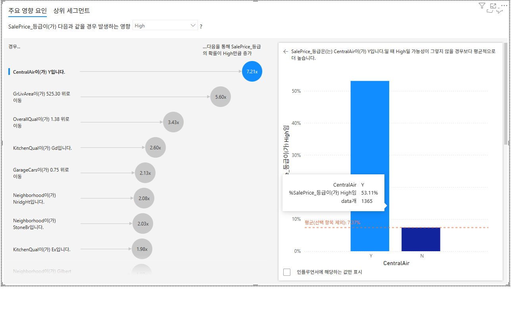
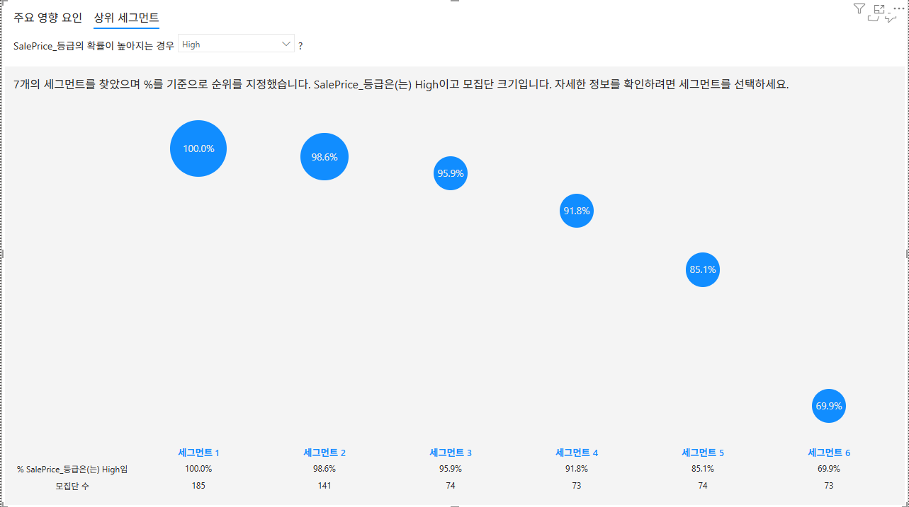

# 과제 5. 주요 영향 요인 — "SalePrice High"를 만드는 요인 [10점]

## 무엇을
Power BI **주요 영향 요인(Key Influencers)** 시각 개체로 고가 주택(High)을 만드는 핵심 요인을 정량적으로 도출.

## 어떻게
과제 4의 `housingprice.pbix` 2페이지에 구성했다.

**계산 열 (DAX)**
```dax
SalePrice_등급 =
IF ( 'data'[SalePrice] >= MEDIANX ( ALL ( 'data' ), 'data'[SalePrice] ), "High", "Low" )
```
중앙값 **$163,000** 기준으로 High/Low가 거의 50:50으로 나뉜다.

**시각 개체 설정**
- 분석 대상: `SalePrice_등급`, 드롭다운에서 **"High"** 선택
- 설명 기준: `OverallQual`, `GrLivArea`, `Neighborhood`, `ExterQual`, `KitchenQual`, `GarageCars`, `YearBuilt`, `TotalBsmtSF`, `CentralAir`
- 연속형 필드(`GrLivArea`·`TotalBsmtSF`·`YearBuilt`·`GarageCars`·`OverallQual`)는 **요약 안 함**으로 설정
  (합계로 집계되면 영향 요인 분석이 왜곡된다 — 실제로 첫 실행 시 `합계 OverallQual`로 잡혀 수정했다)

---

## 결과 — 상위 영향 요인 (실행 화면 실측)



| 순위 | 요인 | High 확률 증가 |
|---:|---|---:|
| 1 | **CentralAir = Y** (중앙냉방 있음) | **7.21x** |
| 2 | **GrLivArea 525.30 증가** | **5.60x** |
| 3 | **OverallQual 1.38 증가** | **3.43x** |
| 4 | KitchenQual = Gd | 2.60x |
| 5 | GarageCars 0.75 증가 | 2.13x |
| 6 | Neighborhood = NridgHt | 2.08x |
| 7 | Neighborhood = StoneBr | 2.03x |
| 8 | KitchenQual = Ex | 1.98x |

### 해석 ① GrLivArea·OverallQual — 과제 1·2·3과 일치
2위 `GrLivArea`(5.60x)와 3위 `OverallQual`(3.43x)은 세 과제의 결과와 정확히 같은 방향이다.

| 방법론 | 1순위 | 2순위 |
|---|---|---|
| 과제 1 — 피어슨 상관 | OverallQual 0.79 | GrLivArea 0.71 |
| 과제 3 — 회귀모델 입력 중요도 | OverallQual | GrLivArea |
| 과제 5 — Key Influencers (수치형 중) | GrLivArea 5.60x | OverallQual 3.43x |

상관계수와 로지스틱 기반 영향도라는 **서로 다른 방법론이 같은 두 변수를 지목**한다.
순위가 뒤바뀐 이유는 측정 대상이 다르기 때문이다 — 상관계수는 "값이 함께 움직이는 정도"를,
Key Influencers는 "1 표준편차만큼 움직였을 때 High가 될 확률의 배수"를 본다.
면적은 변동 폭이 크므로(525 sqft 단위) 확률 변화량이 더 크게 잡힌다.

### 해석 ② Neighborhood — 상관계수가 놓친 변수
`NridgHt`(2.08x)·`StoneBr`(2.03x)는 과제 1 ④번 지역별 평균가 상위 3개 중 2개다.
**Neighborhood는 범주형이라 피어슨 상관 분석 대상에서 아예 빠졌던 변수**인데,
Key Influencers는 범주형도 정량화할 수 있어 그 영향력이 드러났다.
서로 다른 도구를 병행해야 하는 이유를 보여주는 사례다.

### 해석 ③ CentralAir 1위(7.21x) — 인과가 아니라 교란(confounding)
1위 요인이 중앙냉방 여부로 나왔다. **수치 자체는 정확하지만 "냉방을 설치하면 7배 비싸진다"로 읽으면 안 된다.**
원본 데이터로 두 집단을 대조하면 실체가 드러난다.

| | CentralAir = N | CentralAir = Y |
|---|---:|---:|
| 건수 | 95건 (6.5%) | 1,365건 (93.5%) |
| High 비율 | **7.37%** | **53.11%** |
| **건축연도 중앙값** | **1925년** | 1976년 |
| **1950년 이전 건축 비율** | **81%** | 18% |
| OverallQual 평균 | 4.67 | 6.20 |
| GrLivArea 중앙값 | 1,134 sqft | 1,473 sqft |
| 평균 판매가 | $105,264 | $186,187 |

- 배수 계산 검증: 53.11% ÷ 7.37% = **7.21x** — 화면 수치와 정확히 일치한다.
- 중앙냉방은 1970년대 이후 신축 주택의 표준 사양이다. 따라서 `CentralAir = N`은
  **사실상 "1950년 이전에 지은 노후 주택"을 가리키는 대리 변수(proxy)** 다.
- 실제로 N 집단은 건축연도 중앙값이 **1925년**, 81%가 1950년 이전 건축이며 품질·면적도 모두 낮다.
- 즉 가격을 낮추는 진짜 원인은 **노후·저품질·소형**이고, 냉방 부재는 그 결과를 함께 나타내는 표식이다.
- 표본 불균형도 크다 — N 집단이 전체의 6.5%(95건)뿐이라 배수가 과장되기 쉬운 구조다.

> **결론:** Key Influencers는 상관을 정량화하는 도구이지 인과를 증명하는 도구가 아니다.
> 실무 제언으로는 "중앙냉방 설치"가 아니라 **품질(OverallQual)·면적(GrLivArea) 개선**이 유효하며,
> 이는 인과 해석이 안전한 2·3위 요인과도 일치한다.

---

## 상위 세그먼트



7개 세그먼트가 발견되었고, High 비율 순으로 정렬된다.

| 세그먼트 | High 비율 | 모집단 |
|---|---:|---:|
| 세그먼트 1 | **100.0%** | 185건 |
| 세그먼트 2 | 98.6% | 141건 |
| 세그먼트 3 | 95.9% | 74건 |
| 세그먼트 4 | 91.8% | 73건 |
| 세그먼트 5 | 85.1% | 74건 |
| 세그먼트 6 | 69.9% | 73건 |

**세그먼트 1은 185건 전부가 High**(100%)다. 전체 High 비율이 50%인 것과 비교하면,
특정 조건 조합이 고가 여부를 사실상 확정한다는 뜻이다.
세그먼트를 클릭하면 조건 조합(예: OverallQual ≥ 7 이면서 GrLivArea ≥ 1,800)이 표시되며,
이는 과제 1 ②-B에서 확인한 **"품질 7→8 구간에서 중앙값 35% 급등"** 이라는 변곡점과 같은 지점을 가리킨다.

---

## 제출물
- `images/key_influencers.png` — 주요 영향 요인 뷰 (상위 8개 요인 + CentralAir 상세 패널)
- `images/top_segments.png` — 상위 세그먼트 뷰 (7개 세그먼트)
- 과제 4의 `housingprice.pbix` 2페이지에 포함

## 과제 1~3과의 정합성 요약
| 확인 항목 | 결과 |
|---|---|
| OverallQual·GrLivArea가 최상위 요인인가 | ✅ 2·3위 (수치형 중 1·2위) |
| 상위 지역이 과제 1 막대그래프와 일치하는가 | ✅ NridgHt·StoneBr (평균가 2·3위) |
| 상관계수가 놓친 변수가 있는가 | ✅ Neighborhood·CentralAir (범주형) |
| 인과로 오독할 위험이 있는 요인이 있는가 | ⚠️ CentralAir — 노후 주택 대리 변수로 확인·명시 |
