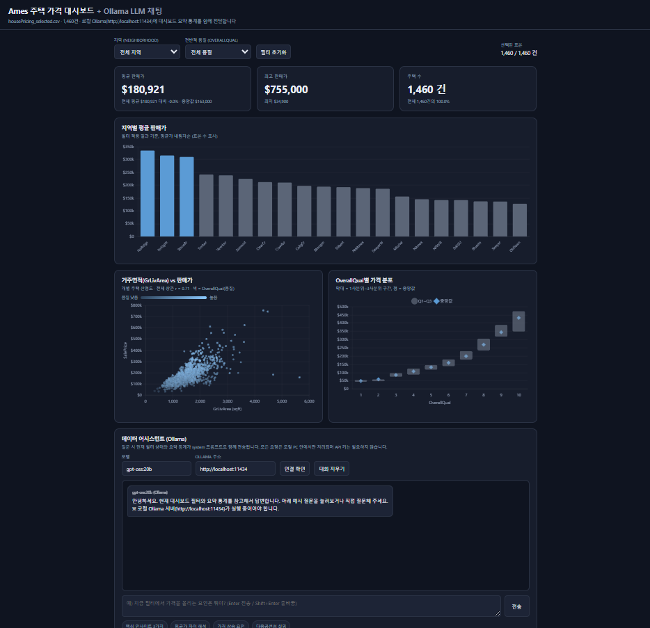

# 과제 6 · HTML 대시보드 개발

Ames(아이오와) 주택 가격 데이터를 **의존성 없이 브라우저에서 바로 열리는 단일 HTML 대시보드**로 만들었습니다.



## 1. 무엇을 만들었나

| 구성 | 내용 |
|---|---|
| KPI 카드 3종 | 평균 판매가 / 최고 판매가 / 주택 수 (필터 결과 기준으로 갱신) |
| 차트 ① | 지역별 평균 판매가 막대그래프 (평균가 상위 20개 지역, 툴팁에 표본 수) |
| 차트 ② | GrLivArea vs SalePrice 산점도 (개별 주택 1,460건) |
| 차트 ③ | OverallQual별 가격 분포 — 막대는 Q1~Q3 구간, 마름모 점은 중앙값 |
| 필터 2종 | 지역(Neighborhood) 드롭다운, 전반적 품질(OverallQual) 드롭다운 + 초기화 버튼 |

필터를 바꾸면 KPI 3종과 차트 3종이 **모두 즉시 재계산**됩니다. (예: `NridgHt` 선택 → 77건, 평균 $316,271)

## 2. 어떻게 동작하나

```
data/housePricing_selected.csv
        │  python build_data.py
        ▼
   data.js  (const DASH_DATA = {meta, rows})
        │  <script src="data.js">
        ▼
   index.html  (Chart.js 로 렌더 + JS 로 필터/집계)
```

- `fetch()` 는 `file://` 에서 CORS 로 차단되므로 **CSV를 읽지 않고**, 집계에 필요한 컬럼만 담은 JS 객체를 별도 스크립트 파일로 임베드합니다. classic `<script src>` 는 `file://` 에서도 로드되므로 **index.html 을 더블클릭하면 그대로 동작**합니다.
- 임베드 컬럼: `OverallQual, GrLivArea, GarageCars, TotalBsmtSF, FullBath, YearBuilt, Fireplaces, SalePrice, Neighborhood` (1,460행, 약 225KB)
- 평균/중앙값/사분위수/지역별 집계는 모두 브라우저에서 계산하므로 어떤 필터 조합이든 정확한 값이 나옵니다.
- Chart.js 4.4.1 은 CDN(jsdelivr)에서 로드합니다. → **차트를 보려면 인터넷 연결이 필요**합니다.

## 3. 실행 방법

```
# 1) 임베드 데이터 생성 (CSV가 바뀌었을 때만 다시 실행)
cd 06_html_dashboard
python build_data.py

# 2) 열기 — index.html 더블클릭 (file:// 로 동작 확인 완료)
```

## 4. 데이터 요약

- 총 1,460건 · 평균 $180,921 · 중앙값 $163,000 · 최저 $34,900 · 최고 $755,000
- SalePrice 왜도 **1.88** (오른쪽 꼬리가 긴 우편향 → 평균 > 중앙값)
- SalePrice 상관 상위: **OverallQual 0.79 · GrLivArea 0.71 · GarageCars 0.64 · TotalBsmtSF 0.61**
- 다중공선성으로 제거된 변수: GarageArea(GarageCars와 r=0.88), TotRmsAbvGrd(GrLivArea와 0.83), 1stFlrSF(TotalBsmtSF와 0.82)

## 5. 읽어낸 인사이트

1. **품질이 가장 강한 신호**: OverallQual 1→10 으로 갈수록 중앙값이 계단식으로 상승하며, Q10 중앙값은 $432,390 으로 Q5($133,000)의 3배가 넘습니다.
2. **입지 프리미엄이 뚜렷**: NoRidge($335,295) · NridgHt($316,271) · StoneBr($310,499) 상위 3개 지역과 하위 지역의 평균가 격차가 2배 이상입니다.
3. **면적 대비 가격은 산포가 큼**: GrLivArea 와 가격은 우상향하지만 같은 면적에서도 가격대가 넓게 퍼져 있어, 면적만으로는 설명이 부족하고 품질·입지가 함께 작용함을 보여줍니다.

## 6. 파일 구성

```
06_html_dashboard/
├─ index.html            대시보드 본체 (HTML + CSS + JS)
├─ build_data.py         CSV → data.js 생성 스크립트
├─ data.js               자동 생성 (직접 수정 금지)
├─ images/dashboard.png  실행 화면
└─ README.md
```
