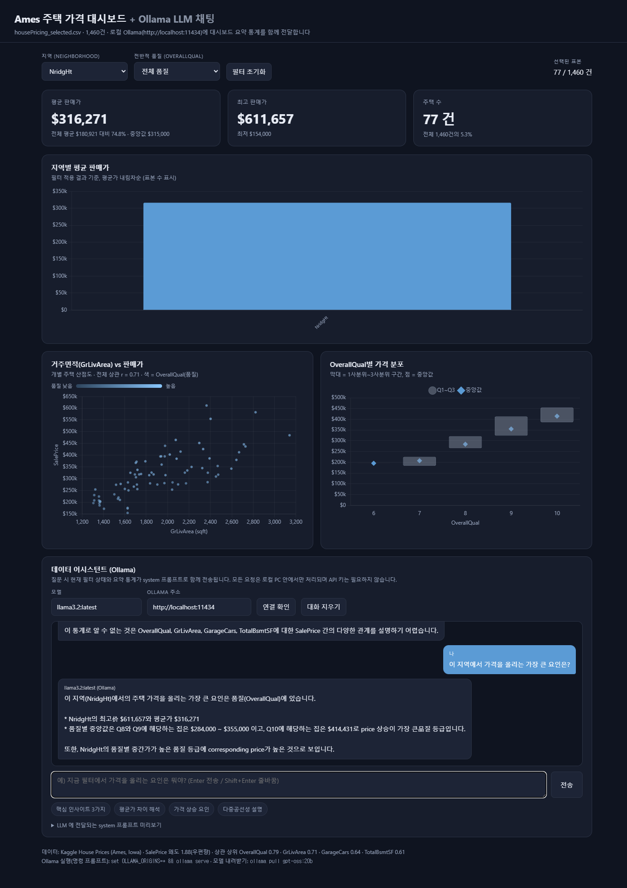

# 과제 7 · Ollama LLM 채팅 연동

과제 6 대시보드를 그대로 확장해서, **로컬 Ollama(gpt-oss:20b)에게 지금 보고 있는 화면의 통계를 넣어 질문하는 채팅 UI**를 붙였습니다.



## 1. 무엇을 만들었나

- 과제 6의 KPI 3종 · 차트 3종 · 필터 2종을 동일하게 유지
- 하단에 **채팅 카드** 추가
  - 대화 영역 + 입력창 (Enter 전송 / Shift+Enter 줄바꿈)
  - **모델명 입력/선택** (기본값 `gpt-oss:20b`, 목록에서 고르거나 직접 입력)
  - **Ollama 주소 입력** (기본값 `http://localhost:11434`)
  - `연결 확인` 버튼 — `/api/tags` 로 설치된 모델 목록 조회
  - 예시 질문 버튼 4개, `대화 지우기`
  - `LLM 에 전달되는 system 프롬프트 미리보기` — 실제로 전송되는 내용을 그대로 확인 가능

## 2. 어떻게 동작하나

질문할 때마다 **현재 필터 상태와 요약 통계를 system 프롬프트로 새로 생성**해서 함께 보냅니다.

```
POST http://localhost:11434/api/chat
{
  "model": "gpt-oss:20b",
  "stream": false,
  "messages": [
    { "role": "system",  "content": "<대시보드 요약 통계 + 현재 필터>" },
    ... 최근 대화 8턴 ...,
    { "role": "user", "content": "사용자 질문" }
  ]
}
```

system 프롬프트에 담기는 정보

- 데이터셋 전체: 건수, 평균/최저/최고/표준편차, 왜도 1.88, 상관 상위 요인, 다중공선성으로 제거된 변수와 사유
- **현재 필터**: 선택된 Neighborhood, OverallQual
- **필터 기준 요약**: 주택 수·비중, 평균가와 전체 대비 증감률, 중앙값, 최저~최고, 평균 거주면적, 평균가 상위 5개 지역, 품질별 중앙값

즉 필터를 바꾸고 질문하면 답변 근거도 함께 바뀝니다. 응답은 `stream:false` 로 한 번에 받습니다.

gpt-oss 계열은 답변이 `message.content` 가 아니라 사고 과정 필드로 오는 경우가 있어, `content` → `thinking` → `reasoning` → `reasoning_content` → `response` 순으로 확인하는 방어 코드를 넣었습니다.

## 3. 실행 방법 (Windows, 명령 프롬프트 `cmd` 기준)

```
:: 1) 모델 내려받기 (최초 1회)
ollama pull gpt-oss:20b

:: 2) 브라우저에서 호출하려면 CORS 허용이 필요합니다.
::    실행 중인 Ollama 를 트레이 아이콘까지 완전히 종료한 뒤, cmd 에서 아래를 실행하세요.
set OLLAMA_ORIGINS=* && ollama serve
```

3) `07_ollama/index.html` 을 더블클릭해서 열고, 채팅 카드의 `연결 확인` 을 눌러 모델 목록이 뜨는지 확인합니다.

### CORS 안내

브라우저에서 `http://localhost:11434` 로 직접 요청하면, 페이지 출처(`file://` 또는 `http://...`)와 Ollama 출처가 달라 **CORS 차단**이 발생합니다. Ollama 는 `OLLAMA_ORIGINS` 환경변수로 허용 출처를 지정하므로, 위 2)처럼 `set OLLAMA_ORIGINS=* && ollama serve` 로 실행해야 합니다.
(`*` 는 모든 출처를 허용하므로 **로컬 학습/실습용으로만** 사용하세요.)

이미 Ollama 가 백그라운드에서 돌고 있으면 새로 띄운 서버가 포트를 잡지 못하고 환경변수도 적용되지 않습니다. 반드시 기존 프로세스를 종료한 뒤 실행하세요.

### 서버 미실행 / CORS 오류 시

요청이 실패하면 채팅창에 붉은 안내 박스가 나타나며, 위 명령들과 `http://localhost:11434/api/tags` 확인 방법, 모델명 확인 방법을 순서대로 안내합니다. (스크린샷의 안내가 그 화면입니다.)

## 4. 보안

- **API 키·비밀번호를 코드에 넣지 않았습니다.** 로컬 Ollama 는 인증이 필요 없습니다.
- 모든 요청은 내 PC 안(localhost)에서만 오가며 외부로 데이터가 나가지 않습니다.
- 단, 대시보드 통계 요약이 프롬프트로 전달되므로 민감 데이터에는 그대로 쓰지 마세요.

## 5. 사용 예시

`핵심 인사이트 3가지` 버튼 → gpt-oss:20b 실제 응답(요약):

> 1) 최고가 지역 NoRidge 평균 $335,295, 이어 NridgHt $316,271, StoneBr $310,499
> 2) $34,900~$755,000 의 넓은 범위, 중앙값 $163,000 < 평균 $180,921 → 우편향
> 3) 품질 등급이 높을수록 가격 상승, Q10 중앙값 $432,390

## 6. 파일 구성

```
07_ollama/
├─ index.html                  대시보드 + 채팅 UI
├─ data.js                     ../06_html_dashboard/build_data.py 가 함께 생성
├─ images/dashboard_chat.png   실행 화면 (서버 미연결 안내 노출 상태)
└─ README.md
```


---

## 제출물 캡처 (2026-08-04 확보)

| 파일 | 내용 |
|---|---|
| `images/dashboard_chat.png` | 대시보드 전체 + Q&A 2건이 표시된 채팅 영역 |
| `images/chat_qa.png` | 채팅 대화 영역 확대 |
| `qa_transcript.md` | 응답 전문 + 인용 수치 검증표 (gpt-oss:20b · llama3.2:latest 양쪽) |

**모델 2종 모두 동작 확인**
- `gpt-oss:20b` — 응답 2건 성공. CPU 추론(14.4GB 중 VRAM 2.3GB)이라 건당 2~6분
- `llama3.2:latest` — 동일 프롬프트로 25초 / 28초 응답. 화면 캡처는 이 모델 기준

모델은 대시보드 UI의 **모델 입력칸에서 즉시 교체** 가능하며, 두 모델 모두
필터 상태(NridgHt)와 해당 지역 통계를 정확히 인용했다 — 인용 수치 전수 대조 결과는 `qa_transcript.md` 참고.
